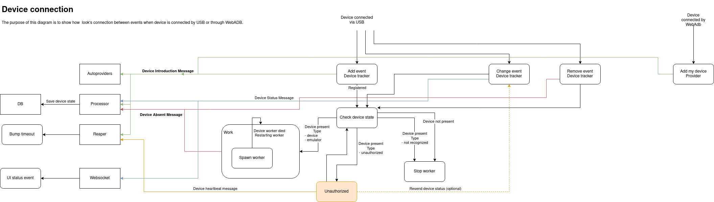

# Connected device flow/states
The purpose of this document is to show better understanding of what happens when a user connects a new device using USB cable or by WebADB

### Overview

- Device connected via USB and Device connected by WebAdb are the inputs. 
- It looks like an adb client sent an events which were handled by this component
- Not rounded squares means the units (Processor/Websocket etc.)
- Rounded squares are methods/functions that control the entire flow
- Arrows with text contained "message" means communication. Additionally, there are added colors for better visualization:
  - Green for start (device register/introduced)
  - Blue for update (device state changed, from offline into unauthorized etc.)
  - Red for an end (device absent/offline)
  - On the orange there is a marked new feature for informing heartbeat to not remove a device in case of the unauthorized state. Dashed line means additional improvement to inform UI (Not needed/implemented currently)
